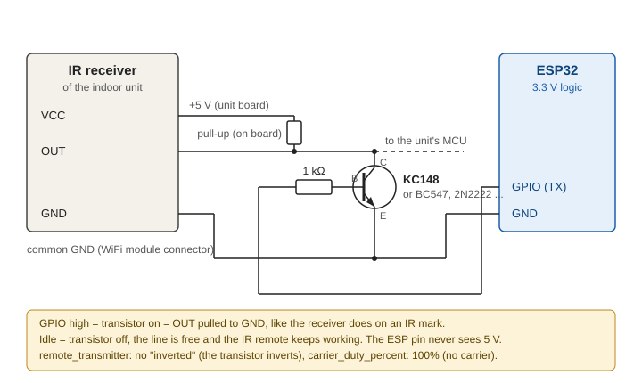

# ESPHOME component to support Gree/Sinclair AC units
This repository adds support for ESP32-based WiFi modules to interface with Gree/Sinclair AC units.
This generally replaces stock WiFi module, sometimes giving a little more advanced features for swing control than stock application or remote.

**USE AT YOUR OWN RISK!**

Work is still in progress!

Tested with Sinclair AC (MV-H09BIF), AYRTON AYL-12BIR and Coolexpert ACH-09BI (both 3-speed Gree-based units; the beeper flag works on the AYRTON, the Coolexpert ignores it).

Communication protocol is based on my own reverse-engineering.

ESPHome interface/binding based on:
* https://github.com/DomiStyle/esphome-panasonic-ac

**USAGE**
* Use at your own risk!
* See: https://github.com/piotrva/esphome_gree_ac/tree/main/examples
* Create configuration file: `ac-sinclair-main.yaml`
* Configure youe ESP `board`, `uart`, optionally `status_led`, check `wifi` settings (secrets)
* Create configuration(s) for your device(s): `ac-living-room.yaml`, `ac-bedroom.yaml`
* Configure deviceid and devicename, use proper `api` and `ota` keys
* Upload initial configuration to your ESP board using USB connection
* Disconnect completely power from your AC system, follow all safety procedures, desolder original WiFI unit
* Prepare a DIY adapter to connect ESP board to the AC unit, see table and representative schematic below
* Reconnect power to your AC system.
* Enjoy!

Generally stock WiFi module outputs UART with 3.3V signal levels and the AC unit outputs UART with 5V signal levels therefore a simple voltage divider on UART from AC unit towards ESP is usually suitable, considering very slow baudrate.
On some stock WiFi PCBs AC unit connector pins are marked on silkscreen.

| AC unit pin | Function | ESP connection        |
| ----------- | -------- | --------------------- |
| 1           | +5V      | VIN / 5V              |
| 2           | RX       | UART TX               |
| 3           | TX       | UART RX (via divider) |
| 4           | GND      | GND                   |


**CONFIGURATION**

Full example for a 3-speed Gree-based unit (Coolexpert ACH-09BI, AYRTON AYL-12BIR):

```yaml
climate:
  - platform: sinclair_ac
    name: ${devicename}
    # unit capabilities (see table below)
    fan_speeds: 3
    quiet_mode: false
    turbo_mode: true
    horizontal_swing: false
    partial_swing: false
    current_temperature_formula: gree
    display_modes: [display_off, set_temperature, actual_temperature]
    # optional entities, remove the ones the unit does not have
    vertical_swing_select:
      name: ${devicename} Vertical Swing Mode
    display_select:
      name: ${devicename} Display Mode
    display_unit_select:
      name: ${devicename} Display Unit
    sleep_switch:
      name: ${devicename} Sleep
    xfan_switch:
      name: ${devicename} X-fan
    save_switch:
      name: ${devicename} Save|8 Heat
```

For the Sinclair MV-H09BIF (5 fan speeds, motorized horizontal louvers) leave all capability
options at their defaults, see `examples/ac-sinclair-main.yaml`.

Unit capability options (all optional):

| option | values | default | what it does |
|---|---|---|---|
| `fan_speeds` | `3`, `5` | `5` | `5`: Low / Medium-Low / Medium / Medium-High / High (Sinclair MV-H09BIF). `3`: Low / Medium / High (most Gree-based units). With `3` the fan speed is sent only in the mode byte, the fine 5-level field stays 0. |
| `quiet_mode` | `true`, `false` | `true` | offer the Quiet fan mode (separate flag in the protocol; the app sends it even to units whose remote has no Quiet button) |
| `turbo_mode` | `true`, `false` | `true` | offer the Turbo fan mode (separate flag, independent of the speed) |
| `horizontal_swing` | `true`, `false` | `true` | `false` for units without motorized horizontal louvers: the climate entity offers only Off / Vertical swing, no horizontal position is ever requested and `horizontal_swing_select` is not allowed |
| `partial_swing` | `true`, `false` | `true` | `false` for units whose louver only swings over the full range: `vertical_swing_select` then offers Off, full swing and the fixed positions only. Such units still report a partial range when the remote selects one (and swing over the full range anyway); that state is shown as full swing. |
| `current_temperature_formula` | `sinclair`, `gree` | `sinclair` | how the room temperature byte is decoded: `sinclair` = `(raw - 16) / 2`, `gree` = `raw - 40`. Both give 24 °C for the same byte, at other temperatures they differ by 1-2 °C. Check: let the unit show the room temperature on its display (`display_select` -> Actual temperature, shown for a few seconds) and compare with HA. |
| `display_modes` | list of `display_off`, `auto`, `set_temperature`, `actual_temperature`, `outside_temperature` | all five | options offered by `display_select`. `auto` is the unit's "no indication" state (shows the set temperature). A state reported by the unit that is not in the list is mapped to the closest one offered (`auto` -> `set_temperature`). Use it for units that cannot show the outside temperature. |
| `beeper_byte`, `beeper_mask` | `0..44`, `1..255` | `40`, `0x01` | experimental: where the "execute silently" flag is placed in the SET packet. Some units ignore the default flag and keep beeping; these options let you try other bits without touching the code. |
| `current_temperature_sensor` | id of a `sensor` | - | use an external sensor as current temperature in HA instead of the unit's own reading (the unit itself still regulates by its own sensor) |

I FEEL (regulate by an external room sensor):

How the unit treats I FEEL (measured on a Coolexpert ACH-09BI, Gree platform): I FEEL is a feature of the remote, not of the unit. The remote measures the room temperature, sends it every 10 minutes and adds the I FEEL bit to every button press. The unit keeps I FEEL only until the next command that comes without this bit, and the UART protocol has no such bit: every change sent over UART - by this component or by the stock WiFi module from the app - switches I FEEL off, the unit falls back to its own sensor and ignores the temperatures the remote keeps sending, until someone presses a button on the remote again. The remote still shows the I FEEL icon meanwhile. The unit reports the real I FEEL state over UART (byte 9 bit 6 of the report), which is what this component uses to keep it on.

Everything else works over UART alone; the IR wiring and the options below are needed only for I FEEL. Without `ir_transmitter_id` the component never touches IR.

The unit accepts a room temperature from outside only through its IR receiver; the same fields in the UART protocol are ignored. With a `remote_transmitter` the component plays the IR remote: a full Gree command with the I FEEL bit switches the function on (built from the state reported over UART, so nothing else changes), then short temperature frames are sent on every whole-degree change and every `i_feel_interval`. The unit confirms over UART, so the component knows whether I FEEL is really active, re-activates it after every power on and gives up after 3 unanswered commands, because each command makes the unit beep. Temperature frames do not beep.

The unit drops I FEEL on every command received over UART. To avoid a double beep (UART command, then the IR command that switches I FEEL back on), changes from HA are sent as a single IR command with the I FEEL bit while I FEEL is wanted, exactly like the remote does: one beep, I FEEL stays on. The unit flags a received IR command in its reports; if neither the flag nor a changed report arrives within 2 s, the change is repeated over UART. The IR frame knows only the fan speeds auto/low/med/high and turbo, so `quiet`, `medlow` and `medhigh` always go over UART (two beeps on such units).

```yaml
remote_transmitter:
  - id: ir_tx
    pin: GPIOxx
    carrier_duty_percent: 50%    # IR LED; use 100% when wired to the IR receiver output (no carrier)

climate:
  - platform: sinclair_ac
    ir_transmitter_id: ir_tx
    i_feel_sensor: room_temperature
    i_feel_interval: 1min
    i_feel_switch:
      name: ${devicename} I Feel
```

| option | values | default | what it does |
|---|---|---|---|
| `ir_transmitter_id` | id of a `remote_transmitter` | - | IR LED aimed at the unit, or a wired connection to the output of the unit's IR receiver (open collector through a transistor, `carrier_duty_percent: 100%`; ESP32 pins are not 5 V tolerant) |
| `i_feel_sensor` | id of a `sensor` | - | temperature in °C the unit should regulate by; requires `ir_transmitter_id`. The unit accepts 0-59 °C. When the sensor loses its value (unavailable in HA, out of range) for 5 minutes, I FEEL is switched off so the unit falls back to its own sensor, and switched on again when the value returns. |
| `i_feel_interval` | time, min `10s` | `1min` | resend period of the temperature frame (the remote uses 10 minutes) |
| `i_feel_switch` | switch | - | turn I FEEL on/off from HA (default ON, state restored); without it I FEEL is always kept on while the sensor has a value |
| `i_feel_header_mark`, `i_feel_header_space` | microseconds | `6000`, `3000` | header of the temperature frame. The unit tells a temperature frame from a command by this header and drops anything else as noise. Two values are in the wild: `6000`/`3000` (newer remotes; confirmed on Coolexpert ACH-09BI) and `8200`/`3800`. If the unit reports I FEEL active but its I FEEL temperature never follows the sensor, try the other pair. |

Wiring for I FEEL without an IR LED:

Instead of an IR LED the ESP can drive the output of the unit's own IR receiver. The receiver output is an open-collector style line, idle high through a pull-up on the unit board and pulled low while an IR mark is received, so a second open collector in parallel works as a wired AND and the original remote keeps working.



* Any small NPN transistor does the job: KC148, BC547, 2N2222 ... Check the pinout of the one you use, it differs between families. Base through 1 kΩ (up to 10 kΩ is fine) from the GPIO, emitter to GND, collector to the OUT pin of the IR receiver (3-pin module VCC / GND / OUT, usually on the display board).
* Do not connect the GPIO to the line directly or through a diode only: the line idles at 5 V and ESP32 pins are not 5 V tolerant.
* `remote_transmitter` needs `carrier_duty_percent: 100%` because the line behind the receiver is already demodulated, and no `inverted` because the transistor inverts.
* Ground is shared through the WiFi module connector.

```yaml
remote_transmitter:
  - id: ir_tx
    pin:
      number: GPIO4
    carrier_duty_percent: 100%
```

Fan modes offered in HA (the number prefix keeps the dropdown ordered):

| `fan_speeds: 5` | `fan_speeds: 3` | protocol |
|---|---|---|
| `0 - Auto` | `0 - Auto` | coarse 0, fine 0 |
| `1 - Quiet` (if `quiet_mode`) | `1 - Quiet` (if `quiet_mode`) | coarse 1, fine 1, quiet flag |
| `2 - Low` | `2 - Low` | coarse 1, fine 1 |
| `3 - Medium-Low` | - | coarse 2, fine 2 |
| `4 - Medium` | `3 - Medium` | coarse 2, fine 3 |
| `5 - Medium-High` | - | coarse 3, fine 4 |
| `6 - High` | `4 - High` | coarse 3, fine 5 |
| `7 - Turbo` (if `turbo_mode`) | `5 - Turbo` (if `turbo_mode`) | coarse 3, fine 5, turbo flag |

Optional entities:

| entity | type | notes |
|---|---|---|
| `vertical_swing_select` | select | 00 Off (louver stays), 01 full swing, 02-06 partial swing ranges, 07-11 fixed positions. Many Gree units only have the full swing, 3 ranges (02 Down, 04 Middle, 06 Up) and 5 fixed positions; a range the unit does not support falls back to full swing. |
| `horizontal_swing_select` | select | 0 Off, 1 full swing, 2-6 fixed positions; only with `horizontal_swing: true` |
| `display_select` | select | see `display_modes`; `display_off` = display light off (LIGHT button on the remote) |
| `display_unit_select` | select | `C` / `F` |
| `plasma_switch` | switch | ionizer / "Health"; some units run it automatically and ignore the switch |
| `sleep_switch` | switch | Sleep function (SLEEP button); the unit clears it when powered off |
| `xfan_switch` | switch | X-fan: after power off the indoor fan keeps running for a few minutes to dry the coil (hold FAN on the remote) |
| `save_switch` | switch | one protocol flag with two meanings: Energy saving in Cool mode, 8 °C frost-protection heating in Heat mode |
| `beeper_switch` | switch | ON (default) = unit beeps on every command from HA, OFF = commands are executed silently (IR remote still beeps). Not reported back by the unit, the switch keeps its own state (`restore_mode`, default `RESTORE_DEFAULT_ON`). Works only on units that honour the flag (AYRTON AYL-12BIR yes, Coolexpert ACH-09BI no). |

**NOTES**
* Packets are sent on a fixed 300 ms timer like the stock WiFi module. Sending right after each unit report (previous behaviour) made some units ignore commands, see [#2](https://github.com/piotrva/esphome_gree_ac/issues/2) and [#25](https://github.com/piotrva/esphome_gree_ac/issues/25).
* Climate state is published to HA only when it changes.
* It was reported [#1](https://github.com/piotrva/esphome_gree_ac/issues/1) that with some changes the code works with Lennox li024ci AC

**TODO**
* Support Timers - maybe unnecessray as timers can be managed by Home Assistant
* Support Time sync - maybe unnecessray as timers can be managed by Home Assistant
